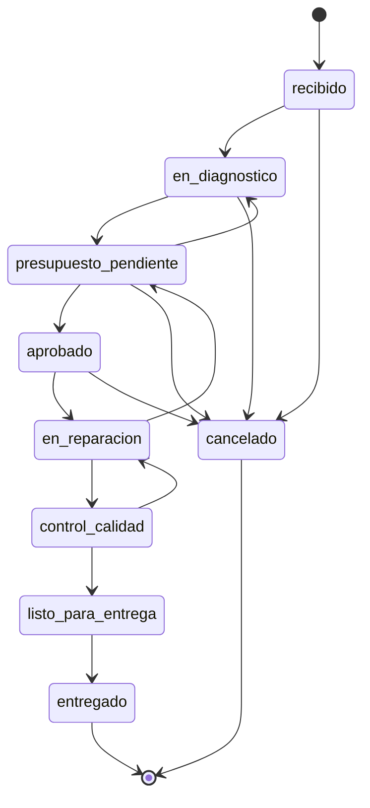

# Flujo de estados de la orden de servicio

Implementado en `supabase/migrations/20260907000400_ordenes.sql`, en las
funciones `mch_transicion_valida()` y `mch_rol_puede_transicionar()`.

La máquina de estados vive en la base de datos, no solo en el backend. Un salto
inválido queda bloqueado aunque alguien escriba directo contra Postgres, desde
un script de carga o desde el SQL Editor de Supabase. El backend replicará la
misma tabla en `app/modules/ordenes/maquina_estados.py` para dar errores útiles
antes de tocar la base, pero la barrera real está abajo.

## Diagrama

## Transiciones y autorización

| Desde | Hacia | Roles autorizados |
|---|---|---|
| `recibido` | `en_diagnostico` | asesor, admin |
| `en_diagnostico` | `presupuesto_pendiente` | técnico, admin |
| `presupuesto_pendiente` | `aprobado` | asesor, admin |
| `presupuesto_pendiente` | `en_diagnostico` | asesor, admin |
| `aprobado` | `en_reparacion` | técnico, asesor, admin |
| `en_reparacion` | `control_calidad` | técnico, admin |
| `en_reparacion` | `presupuesto_pendiente` | técnico, admin |
| `control_calidad` | `listo_para_entrega` | asesor, técnico, admin |
| `control_calidad` | `en_reparacion` | asesor, técnico, admin |
| `listo_para_entrega` | `entregado` | asesor, admin |
| cualquiera menos `en_reparacion` y posteriores | `cancelado` | asesor, admin |

`entregado` y `cancelado` son terminales.

## Reglas asociadas

- Una orden **siempre nace en `recibido`**. Insertarla en otro estado falla.
- Pasar a `entregado` fija `fecha_entrega` automáticamente si venía vacía.
- Pasar a `cancelado` **exige** `motivo_cancelacion`.
- Cada cambio escribe una fila en `orden_eventos` con estado anterior, nuevo,
  usuario y momento. Esa bitácora es la fuente de las métricas de tiempo.

### Trabajo adicional descubierto en reparación

`en_reparacion → presupuesto_pendiente` existe justamente para esto. No se
amplía el monto ya aprobado: se emite una **nueva versión** del presupuesto
sobre la misma orden. El presupuesto anterior queda intacto como registro de lo
que el cliente aceptó en su momento.

### Autorización cuando no hay sesión

`mch_rol_puede_transicionar()` solo se evalúa si `mch_rol_actual()` devuelve un
rol. Cuando es NULL —migraciones, `seed.sql`, worker de notificaciones— se
valida únicamente que la transición exista en la máquina. Es lo que permite que
el seed recorra el flujo completo sin suplantar a un usuario, y a la vez que un
técnico no pueda entregar un vehículo desde la app.

### Aprobación por parte del cliente

El cliente no tiene sesión. Aprueba desde un enlace con el `token_publico` del
presupuesto, que resuelve un endpoint público del backend con el rol de
servicio. Ese endpoint valida el token, marca el presupuesto y mueve la orden a
`aprobado`. El token no se expone por RLS: `anon` no tiene privilegio sobre
ninguna tabla de `public`.
